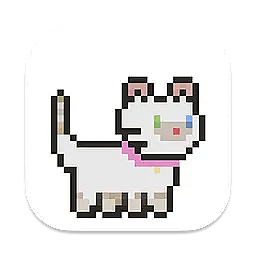

  
  <h1>Cupcake</h1>
  
Adorable animated kitties for your Dock

  
Pick one, give it a personality, and let it do its thing.

  

    <a href="https://github.com/wizenheimer/cupcake/releases"><strong>✨ Explore the cuteness »</strong></a>
  

## Overview

Cupcake brings the most precious little furballs to your macOS Dock. They bounce around with the most adorable little hops and honestly just make your computer so much more delightful. Not exactly productive, but who cares when they're this precious?

**What makes it purr-fect:**

  

https://github.com/user-attachments/assets/d1d79d0b-2249-4d80-b357-beb596a04253

- 11 absolutely adorable cattos
- Two precious moods: Chill or Wiggle
- Super lightweight so your Mac stays happy
- Makes your Dock the cutest place on your Mac

## License

MIT License because sharing is caring and everyone deserves cupcake happiness! Use it, love it, make it even more amazing.
